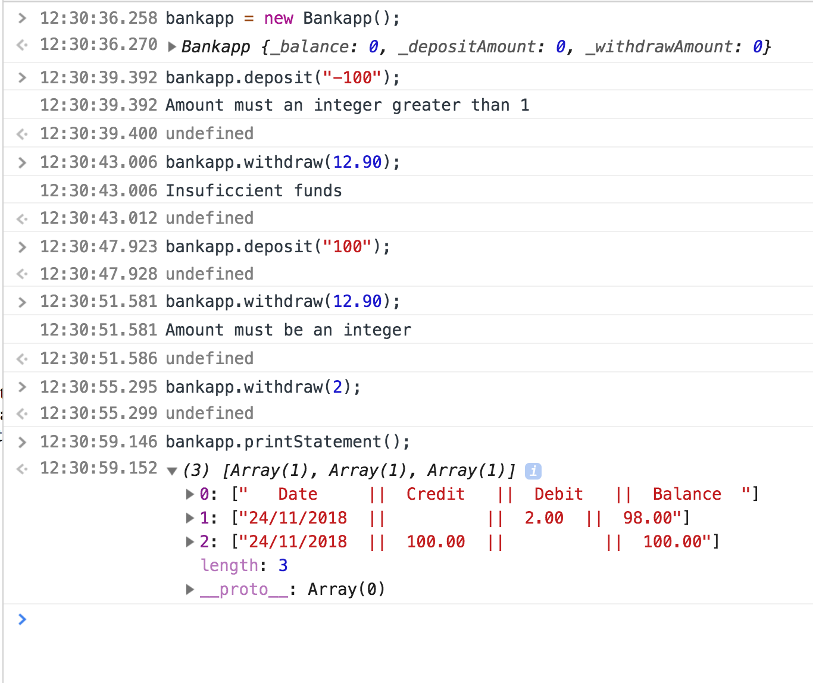

Introduction
============
This is a simple app than runs in the console. It records users financial activity and allows the user to print out a statement.  

### Requirements

* Should be able to interact with the code via JavaScript console.
* Deposits, withdrawal.
* Account statement (date, amount, balance) printing.
* Data can be kept in memory (it doesn't need to be stored to a database or anything).

### Acceptance criteria

**Given** a client makes a deposit of 1000 on 10-01-2012  
**And** a deposit of 2000 on 13-01-2012  
**And** a withdrawal of 500 on 14-01-2012  
**When** she prints her bank statement  
**Then** she would see

```
date || credit || debit || balance
14/01/2012 || || 500.00 || 2500.00
13/01/2012 || 2000.00 || || 3000.00
10/01/2012 || 1000.00 || || 1000.00
```


### How to use
Clone the repo `git clone https://github.com/fabjab86/Bank_Tech_Test.git`  
`cd Bank_Tech_Test`
If you do not have _npm_ installed you can install it from [here](https://www.npmjs.com/get-npm)    
`npm install`  
`npm start`  

### How to run the tests
`npm test` to run jasmine  
If you have ESLint installed globally then you can use these commands  
`eslint src` and `eslint spec`  
If you do not you can run these commands  
`./node_modules/.bin/eslint src`  
`./node_modules/.bin/eslint spec`  

### Screenshot of the application

